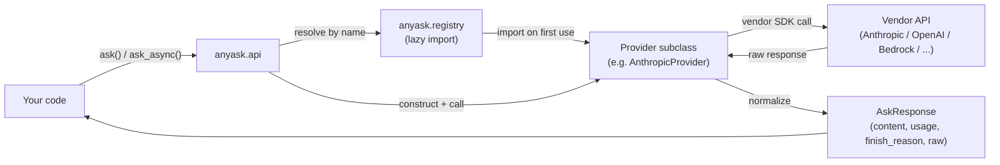
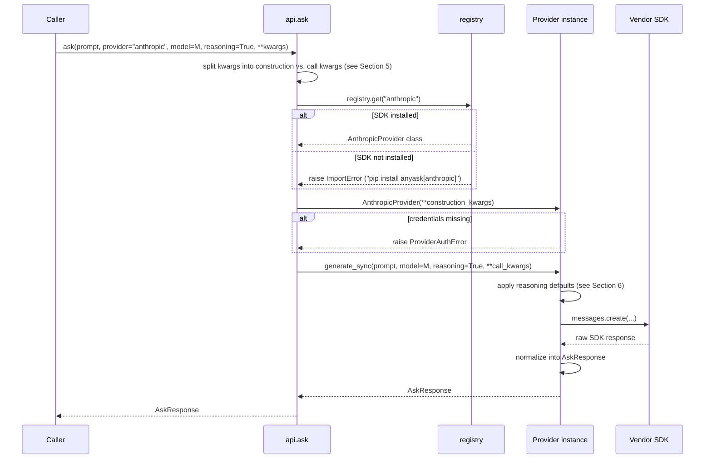
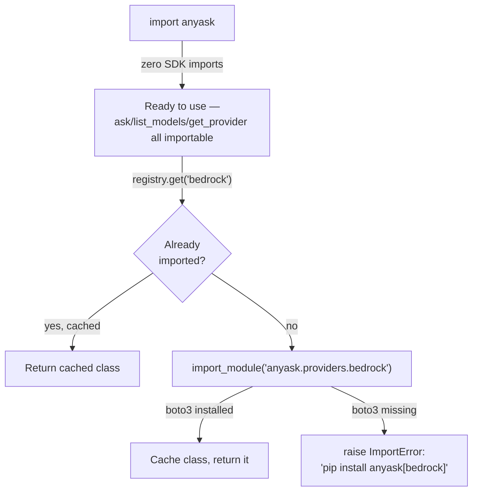
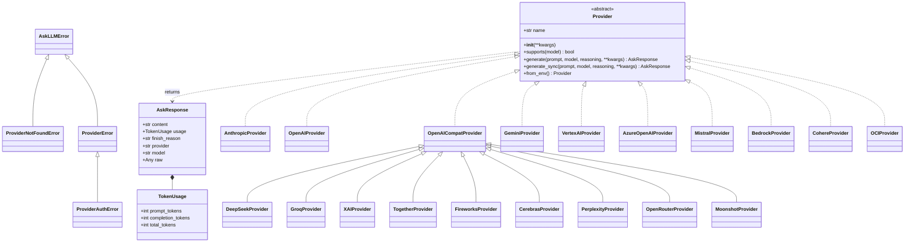
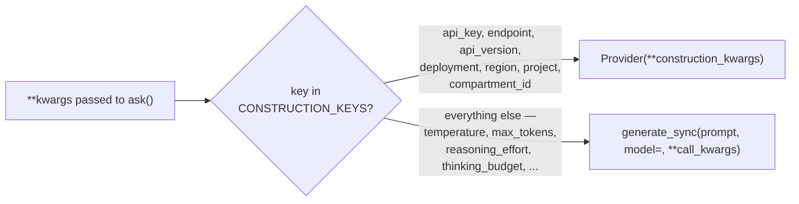
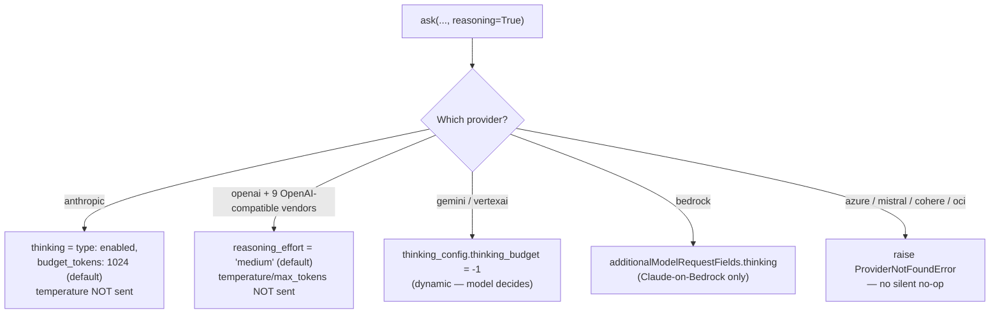
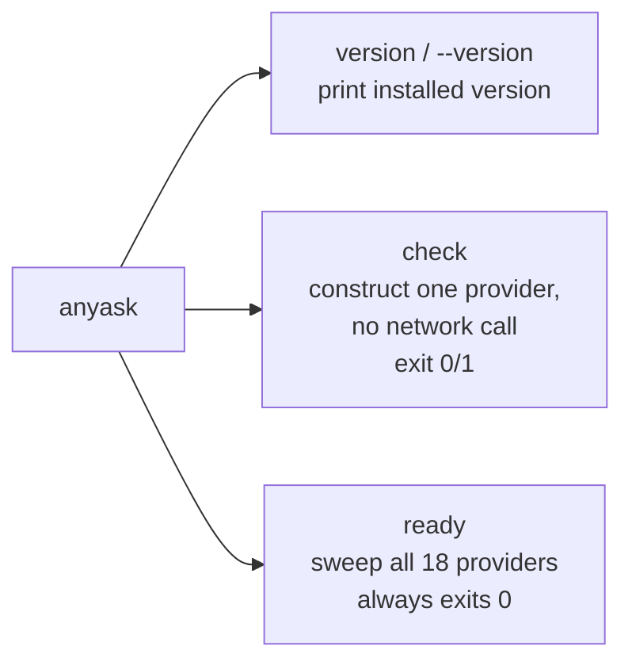

# anyask — Technical Specification

This document describes what `anyask` is, why it's built the way it is, and how a
call flows through it end to end. It's aimed at both API users who want to
understand the contract they're calling into, and contributors who need the
internal architecture. For the published, versioned docs site, see
[`docs/`](docs/index.md); this file is the single-source design reference that
docs/README/CHANGELOG all derive from.

---

## 1. Purpose & Scope

`anyask` does exactly one job: **call an LLM provider, get its raw response back.**

That's the entire scope, deliberately. It does not route between providers, does
not retry or fall back from one vendor to another, does not track cost, does not
manage prompts/templates, and does not orchestrate multi-step agent behavior. Every
one of those is a legitimate thing to want — they just don't belong *inside* a
package whose contract is "one function, any provider, raw response." Callers who
want routing/fallback/retry build it on top, using `anyask` as the uniform
transport underneath.

**Lightweight installation is a strategic pillar of that scope, not a side
effect.** A bare `pip install anyask` pulls in exactly one dependency
(`PyYAML`); using one specific provider adds only that provider's own SDK,
never the other 16. That's what a single-responsibility footprint should look
like — a package doing one job doesn't need one-of-everything installed to do
it. In practice that makes `anyask` cheap to bake into a container image, fast
to install in a CI job, and safe to pull in as a transitive dependency without
dragging in SDKs nothing downstream ever touches — the same property that
makes it a good fit for ephemeral or CI/CD environments generally, whatever a
given project's own testing setup looks like. See
[Dependency Footprint](docs/guides/dependency-footprint.md) for measured
install sizes per provider.

## 2. Design Principles

1. **Explicit over implicit.** `provider` and `model` are always required,
   explicit arguments. There is no default provider, no environment-based
   auto-selection, no model-name-prefix routing (`"claude-..."` → anthropic).
2. **No silent behavior.** If something can't be done — an unknown provider, a
   missing SDK, a provider that doesn't support `reasoning=True` — it raises
   immediately with a clear error, rather than degrading silently.
3. **Lazy, opt-in dependencies.** `pip install anyask` installs zero provider
   SDKs. A provider's SDK is only imported the moment that specific provider is
   used, via one pip extra per provider (§4.3).
4. **One normalized response shape, real provider-specific data preserved.**
   Every provider returns the same `AskResponse` shape (§3), but fields that are
   inherently provider-specific — `finish_reason` above all — are kept raw, not
   coerced into a false cross-provider abstraction.
5. **Real mechanisms only, never simulated.** `reasoning=True` (§6) enables each
   provider's own actual reasoning mechanism where one exists, and raises rather
   than pretending to support it where one doesn't.

## 3. Public API

```python
def ask(prompt: str, *, provider: str, model: str, reasoning: bool = False, **kwargs) -> AskResponse: ...
async def ask_async(prompt: str, *, provider: str, model: str, reasoning: bool = False, **kwargs) -> AskResponse: ...
def list_models(provider: str, **kwargs) -> list[str]: ...
async def list_models_async(provider: str, **kwargs) -> list[str]: ...
def get_provider(provider: str, **config) -> Provider: ...
```

```python
@dataclass(frozen=True)
class TokenUsage:
    prompt_tokens: Optional[int]
    completion_tokens: Optional[int]
    total_tokens: Optional[int]

@dataclass(frozen=True)
class AskResponse:
    content: str
    usage: TokenUsage
    finish_reason: Optional[str]   # RAW, provider-specific — never normalized
    provider: str
    model: str
    raw: Any                       # the untouched original SDK response object
```

```python
class AskLLMError(Exception): ...
class ProviderNotFoundError(AskLLMError): ...   # unknown provider, or missing capability
class ProviderError(AskLLMError): ...            # provider call failed (raised `from exc`)
class ProviderAuthError(ProviderError): ...       # missing/invalid credentials at construction
```

Full narrative docs: [Quickstart](docs/getting-started/quickstart.md) ·
[Providers](docs/providers/index.md) · [API Reference](docs/reference/index.md)
(mkdocstrings-generated from the docstrings above).

## 4. Architecture

### 4.1 Component overview



### 4.2 A single `ask()` call, end to end



### 4.3 Lazy per-provider imports

The reason a bare `pip install anyask` needs no provider SDK: `registry.get(name)`
only imports that one provider's module the first time it's asked for, and caches
the result. Nothing eager scans or imports every provider at `import anyask` time.



### 4.4 Types and the provider hierarchy



19 registry entries total: 18 concrete vendor providers + `openai_compat` itself
(the internal generic base for arbitrary OpenAI-compatible endpoints, registered
but not one of the 18 documented/named providers).

## 5. Provider construction: the kwargs split

`ask()`/`ask_async()`/`list_models()` all accept `**kwargs` and split it in the
same way: a fixed set of *construction keys* goes to the provider's `__init__`,
everything else is forwarded to the generation call unchanged.



Every provider's `__init__(self, **kwargs)` pulls only the keys it actually needs
and ignores the rest — this is what lets the *same* kwargs dict be handed to any
provider class without an if/elif dispatch on provider name. `get_provider()`
returns the constructed `Provider` instance directly, for callers who want to
build once and call `generate_sync()`/`generate()` many times instead of paying
SDK-client-construction cost on every single `ask()` call.

`temperature=0.2`/`max_tokens=2048` are applied as defaults by every provider when
not explicitly passed — consistent across all 18 providers, so identical `ask()`
calls don't silently get different sampling behavior depending on which vendor
happens to be selected.

## 6. `reasoning=True` behavior

Enables extended/deliberate reasoning using each provider's own real mechanism.
Support is not uniform — providers with no documented per-call toggle raise rather
than silently ignoring the flag.



Every real-support provider still lets an explicit kwarg (`thinking_budget=N`,
`reasoning_effort="high"`, ...) override the `reasoning=True` default — the
boolean only changes what happens when you *don't* specify one yourself.

## 7. Providers

18 named providers, one interface. Full credential/env-var/default-model table:
[docs/providers/index.md](docs/providers/index.md).

| Auth shape | Providers |
|---|---|
| API key | openai, anthropic, gemini, mistral, cohere, and the 9 OpenAI-compatible vendors (deepseek, groq, xai, together, fireworks, cerebras, perplexity, openrouter, moonshot) |
| API key + endpoint/deployment | azure |
| Cloud-platform credential chain (no API key) | bedrock (AWS), vertexai (GCP ADC), oci (`~/.oci/config`) |

## 8. CLI

A small `anyask` console script, built on stdlib `argparse` (not `click`, to keep
the bare install at 2 packages):



`check`/`ready` never call a provider's API — they exercise the same
construction path `get_provider()` uses internally (SDK import + each provider's
existing fail-fast credential validation), so "ready" means "would construct
successfully," not "a live call would succeed." Full reference:
[docs/cli/index.md](docs/cli/index.md).

## 9. Versioning & release process

`bump2version` keeps `pyproject.toml`, `anyask/__init__.py`, and
`.bumpversion.cfg` in sync in one commit + tag, whenever a
`bump-patch`/`bump-minor`/`bump-major` step runs.

```mermaid
flowchart LR
    Dev["develop branch\nfeature commits"] -->|"scripts/release.ps1 bump-patch"| Bump["version bump\ncommit + local tag"]
    Bump -->|"release-test"| TestTag["push vX.Y.Z-test tag"]
    TestTag -->|"publish-testpypi.yml"| TestPyPI["TestPyPI"]
    TestPyPI -.->|"confirm passes"| Merge["merge develop → main"]
    Merge -->|"release-prod"| ProdTag["push vX.Y.Z tag\n+ GitHub Release"]
    ProdTag -->|"publish-pypi.yml\n(OIDC trusted publisher)"| PyPI["PyPI"]
```



## 10. Explicitly out of scope

These come up naturally when discussing a multi-provider LLM package — noting them
here so they're a deliberate decision, not a gap:

- **Routing / fallback / retry across providers** — was present in an earlier
  design, removed as dead code before the first release. Build it on top if you
  need it; `anyask` stays the uniform transport underneath.
- **Cost/pricing estimation** — a per-provider, per-model price table is
  disproportionate upkeep for what this package is; belongs in dedicated
  cost-tracking tooling.
- **Streaming responses** — not implemented by any provider currently; a real
  gap, not a design decision, should the need arise.
- **Config files** — credentials resolve from explicit kwargs or environment
  variables only, no config-file layer.
- **Prompt/template management, multi-turn conversation state, agent
  orchestration** — all out of scope by design; `ask()` takes a single prompt
  string and returns a single response, nothing stateful in between.
- **System prompts** — not part of the contract; `prompt` is always the whole
  message. A few providers happen to accept one through a provider-specific
  `**kwargs` name (Anthropic's/Bedrock's `system=`, Gemini's
  `system_instruction=`), since those pass straight through to the
  underlying SDK call, but that's incidental provider behavior, not
  something anyask guarantees or normalizes across providers.
- **Multi-modal input/output** — `prompt` is always plain text and
  `AskResponse.content` is always plain text; no images, audio, files, or
  structured response parts. Anything a provider's raw response carries
  beyond that is still reachable via `AskResponse.raw`, just not through a
  normalized field.
